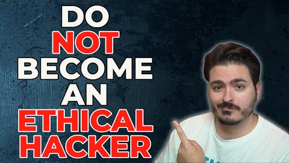

# Course Introduction
## What is Ethical Hacking
- Hired to do a Job
- Staying within Scope
## Why This Course?
- Standard courses leave out a lot of details
	- They don't prep you for interviews
- Take you from "Zero" to "Hero"
	- Be "Job Ready" by the end of this course.
## What We'll Cover:
- Foundations
	- Introduction to Lab Environment
	- Kali Linux Overview + Command Line (labs)
	- Computer Networking Refresher
	- Introductory Python (labs)
	- The Five Stages of Ethical Hacking
	- Scanning and Enumeration (labs)
- Hacking Basics
	- Exploitation Basics (labs)
	- External Penetration Testing Tactics (labs)
	- Mid-Course Capstone (labs)
	- Exploit Development (labs)
	- Active Directory Exploitation (labs)
	- Web Application Exploitation (labs)
	- Wireless Network Exploitation (labs)
- Other
	- Legal Documentation
	- Report Writing
	- Career Advice
## Pre-requisites
- Basic IT knowledge
- For Mid-Course Capstone
	- Minimum of 12GB of RAM is suggested
- For Wireless Hacking
	- A wireless adapter that supports monitor mode is suggested
		- Link provided in this course
- For Active Directory Lab Build
	- Minimum of 16GB of RAM is suggested.
		- Students can still participate in the course, but may experience slow lab environments

-----

  
Premade Notes from the above section: 

Resources for this video:

- TCM Security Website - https://tcm-sec.com/

- The Cyber Mentor Website - https://www.thecybermentor.com/

- The Cyber Mentor Twitter - https://twitter.com/thecybermentor/

- The Cyber Mentor Twitch - https://twitch.tv/thecybermentor/

- My LinkedIn: - https://linkedin.com/in/heathadams/

-----
-----
# Course Discord (Important)
## Discord Server
- `# start-here-academy`
	- Click the Emote for the course that you are apart of
- Close to 24/7 support from staff
	- You can also ask the community for assistance

-----

  
Premade Notes from the above section: 

Course Discord - https://discord.gg/tcm

-----
-----
# A Day in the Life of an Ethical Hacker
## A Pentester's Day to Day
- Roll Out of Bed
	- Perform an Assessment
		- Write a Report
			- Give a Debrief
- Could be all three
## Assessment: External Network Pentest
- Assessing an Organization's security from the outside looking in
- Methodology focuses heavily on Open-Source Intelligence (OSINT) Gathering
- Typically lasts 32-40 hours with another 8-16 for report writing
## Assessment: Internal Network Pentest
- Assessing an Organization's security from inside the network
- Methodology focuses heavily on Active Directory attacks
- Typically lasts 32-40 hours with another 8-16 for report writing
## Assessment: Web Application Pentest
- Assessing an Organization's web application security
- Methodology focuses heavily on web-based attacks and the OWASP testing guidelines
- Typically lasts 32-40 hours with another 8-16 for report writing
## Assessment: Wireless Pentest
- Assessing an Organization's wireless network security
- Methodology depends on wireless type being used 
	- Guest vs WPA2-PSK vs WPA2 Enterprise
- Typically lasts 4-8 hours per SSID with another 2-4 for report writing
## Assessment: Physical Pentest & Social Engineering
- Assessing an Organization's physical security and/or end-user training
- Methodology depends on task and goals
- Typically lasts 16-40 hours with another 4-8 for report writing
## Other assessments
- Mobile Penetration Testing
- IoT Penetration Testing
- Red Team Engagements
- Purple Team Engagements
- Plus even more
## Report Writing
- A report is typically delivered within a week after the engagement ends
- Report(s) should highlight both non-technical (Executive) and technical findings
- Recommendations for remediation should be clear to both executives and technical staff
## Debrief
- A debrief walks through your report findings
	- This can be with technical and non-technical staff present.
- It gives an opportunity for the client to ask questions and address any concerns before a final report is released

-----

  
Premade Notes from the above section: 

No Specific Notes for this Section.

If you're reading this though, make sure you *Star* this Repository!

-----
-----
# Why You Shouldn't Be An Ethical Hacker
'

*`Click the Image to watch the video on Youtube`*
## Money
- While yes, it does pay well
	- Starting salary is usually $100k+
- This is a field that you need to be passionate about
## Easily complacent
- This is not a career that you can just "Coast" through
	- Cyber-Security is constantly changing
## Hate to Study
- Always have to stay on top of the constantly changing environment
- New vulnerabilities are always being found and released
## Passion
- If you're not passionate about this, you won't stay motivated to stay on top.
- This is a job where you have to wake up, and not be sad that you're going into work.
## Technical
- Be able to Write / Communicate
	- Be able to translate a technical explanation to a simple to understand explanation
## Introverted
- If you are not able to be occasionally extroverted
	- This probably isn't a great field for you.

-----

  
Premade Notes from the above section: 

No Specific Notes for this Section.

If you're reading this though, make sure you *Star* this Repository!

-----
-----

