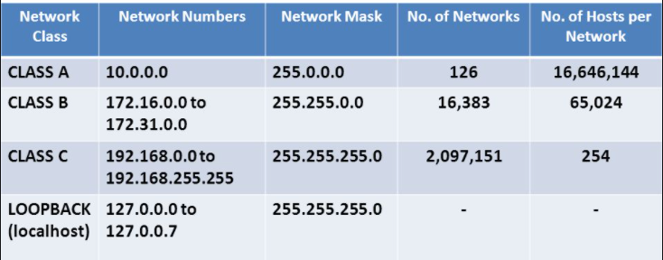
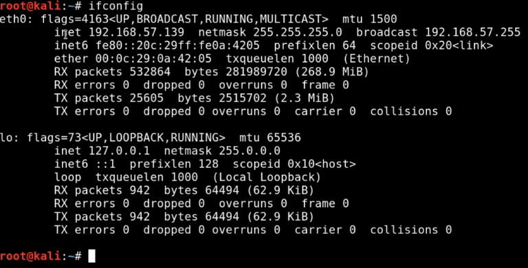
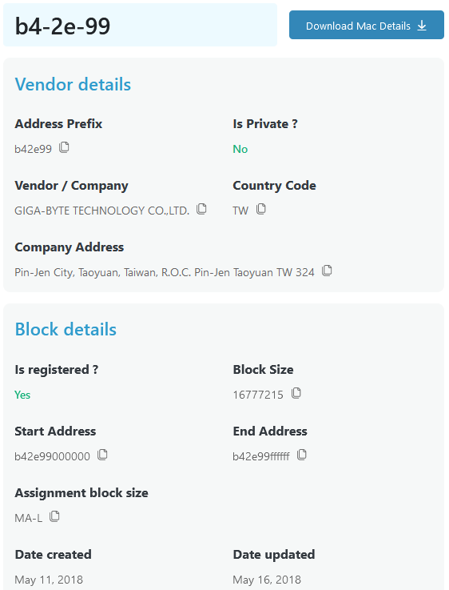

# Introduction
- IP Address
- MAC Addresses
- TCP
- UDP
- Three-Way Handshake
- Common Ports and Protocols
- The OSI Model
- Subnetting

-----
<details>
  <summary>Premade Notes from the above section: </summary>

No Specific Notes for this Section.

If you're reading this though, make sure you *Star* this Repository!

</details>

-----
-----
# IP Addresses (Layer 3)
## ifconfig / ipconfic
- Linux = ifconfig
	- inet = IPv4
	- inet6 = IPv6
- Windows = ipconfig
## IPv4
- Most commonly used variation of IP Adress
	- 192.xxx.xx.xxx
		- 8 bits in each section
			- 32 bits in total
				- 4 bytes in total

```
| 128 | 064 | 032 | 016 | 008 | 004 | 002 | 001 |
|-----|-----|-----|-----|-----|-----|-----|-----|
|  1  |  1  |  1  |  1  |  1  |  1  |  1  |  1  |  = 255
```

```
| 128 | 064 | 032 | 016 | 008 | 004 | 002 | 001 |
|-----|-----|-----|-----|-----|-----|-----|-----|
|  0  |  0  |  0  |  0  |  0  |  1  |  1  |  1  |  = 7
```

```
IPv4:
2^32 = 4,294,967,296
```

```
IPv6:
2^128 = 340,282,366,920,938,463,463,374,607,431,768,211,456
```
## NAT (Network Address Translation)
- Will explain later, but...
	- 192.168 = Local IP Address / Private IP Address
		- Class C Address





-----
<details>
  <summary>Premade Notes from the above section: </summary>

IPv4 (Internet Protocol version 4) and IPv6 (Internet Protocol version 6) are two versions of the Internet Protocol, which is the underlying protocol that enables communication on the internet. They are used to identify and locate devices on a network.

IPv4 addresses are 32-bit numerical addresses represented in a dotted-decimal format, such as "192.168.0.1". Each section, or octet, of the address consists of 8 bits and can range from 0 to 255. This allows for a total of approximately 4.3 billion unique addresses. However, due to the rapid growth of the internet, the number of available IPv4 addresses has become limited, leading to the development of IPv6.

IPv6 addresses are 128-bit addresses represented in a hexadecimal format, such as "2001:0db8:85a3:0000:0000:8a2e:0370:7334". The longer address length of IPv6 allows for a significantly larger number of unique addresses, approximately 3.4×10^38. IPv6 addresses are divided into eight groups of four hexadecimal digits, separated by colons. Leading zeros within a group can be omitted, and consecutive groups of zeros can be represented by a double colon (::) to simplify the address.

The transition from IPv4 to IPv6 is necessary due to the depletion of available IPv4 addresses. IPv6 provides a solution to the address shortage while also introducing improvements in security, auto-configuration, and other features. However, IPv4 and IPv6 are not directly compatible, so various mechanisms and transition technologies exist to enable communication between the two protocols.

In summary, IPv4 and IPv6 are versions of the Internet Protocol that provide unique addresses to devices on a network. IPv4 addresses are 32-bit, while IPv6 addresses are 128-bit. IPv6 offers a larger address space and additional features compared to IPv4.

</details>

-----
-----
# MAC Addresses (Layer 2)
## Media Access Control
- Linux = ifconfig
	- ether = MAC
		- First three bytes = Identifier
			- Example:) `00:0c:29` = VMWare
- Windows = ipconfig/all
	- Physical Address = MAC



-----
<details>
  <summary>Premade Notes from the above section: </summary>

A MAC (Media Access Control) address is a unique identifier assigned to network interface controllers (NICs) of network devices. It is a hardware address that is permanently assigned by the manufacturer and is stored in the device's firmware or read-only memory (ROM). MAC addresses are used at the data link layer of the OSI model to ensure that data is delivered to the correct device within a local network.

MAC addresses are typically 48 bits in length and are expressed as a sequence of six pairs of hexadecimal digits separated by colons or hyphens. For example, a MAC address may look like "00:1A:2B:3C:4D:5E". The first three pairs of digits identify the manufacturer of the network interface card, while the last three pairs provide a unique identifier for the specific device.

MAC addresses play a crucial role in Ethernet networks, as they allow devices to communicate with each other within a local area network (LAN). When data is sent from one device to another on the same network, it is encapsulated within Ethernet frames that contain the source and destination MAC addresses. Routers and switches use these MAC addresses to forward the data to the appropriate destination.

It's important to note that MAC addresses are specific to the local network and do not have global uniqueness like IP addresses. They are only relevant within the scope of the local network segment. When data needs to be transmitted beyond the local network, it is encapsulated in network packets that contain source and destination IP addresses.

In summary, a MAC address is a unique identifier assigned to the network interface controller of a device. It is used at the data link layer to facilitate communication within a local network. MAC addresses are hardware-based, manufacturer-specific, and differ from IP addresses, which are used for network communication on a larger scale.

</details>

-----
-----

# TCP, UDP, and the Three-Way Handshake
## Placeholder
- Placeholder
	- Placeholder

-----
<details>
  <summary>Premade Notes from the above section: </summary>

TCP (Transmission Control Protocol) and UDP (User Datagram Protocol) are two commonly used transport layer protocols in computer networks.

TCP is a connection-oriented protocol that provides reliable, ordered, and error-checked delivery of data packets over an IP network. It guarantees that data sent from one device is received correctly by the destination device. TCP achieves this reliability through mechanisms like acknowledgement, retransmission, and flow control. It breaks data into smaller packets, assigns sequence numbers to them, and ensures they are reassembled correctly at the receiving end. TCP is widely used for applications that require guaranteed delivery, such as web browsing, email, file transfer, and remote login.

UDP, on the other hand, is a connectionless protocol that does not provide the same level of reliability as TCP. It is simpler and more lightweight, making it suitable for applications that can tolerate some data loss or delay. UDP does not establish a connection or guarantee delivery of packets. It simply sends data packets from one device to another without waiting for acknowledgements or retransmissions. UDP is commonly used for real-time applications like streaming media, online gaming, DNS (Domain Name System), and VoIP (Voice over IP).

The three-way handshake is a process used by TCP to establish a connection between two devices. It is a sequence of three steps that takes place before data transmission can begin. Here's how the three-way handshake works:

1. SYN (Synchronize): The initiating device (often referred to as the client) sends a TCP packet with the SYN flag set to the destination device (often referred to as the server). This packet indicates the desire to establish a connection and includes an initial sequence number.
2. SYN-ACK (Synchronize-Acknowledge): Upon receiving the SYN packet, the destination device responds with a TCP packet that has both the SYN and ACK (acknowledge) flags set. This packet acknowledges the receipt of the initial SYN packet and also includes its own initial sequence number.
3. ACK (Acknowledge): Finally, the initiating device acknowledges the SYN-ACK packet by sending an ACK packet back to the destination. This packet confirms the establishment of the connection and typically contains an incremented sequence number.

Once the three-way handshake is complete, the connection is established, and both devices are ready to exchange data. The sequence numbers exchanged during the handshake are used to ensure that data is transmitted and received in the correct order.

In summary, TCP is a reliable, connection-oriented protocol that guarantees delivery of data, while UDP is a simpler, connectionless protocol that does not provide the same level of reliability. The three-way handshake is a process used by TCP to establish a connection between devices, involving the exchange of SYN, SYN-ACK, and ACK packets.

</details>

-----
-----

# Placeholder
## Placeholder
- Placeholder
	- Placeholder

-----
<details>
  <summary>Premade Notes from the above section: </summary>

No Specific Notes for this Section.

If you're reading this though, make sure you *Star* this Repository!

</details>

-----
-----

# Placeholder
## Placeholder
- Placeholder
	- Placeholder

-----
<details>
  <summary>Premade Notes from the above section: </summary>

No Specific Notes for this Section.

If you're reading this though, make sure you *Star* this Repository!

</details>

-----
-----

# Placeholder
## Placeholder
- Placeholder
	- Placeholder

-----
<details>
  <summary>Premade Notes from the above section: </summary>

No Specific Notes for this Section.

If you're reading this though, make sure you *Star* this Repository!

</details>

-----
-----

# Placeholder
## Placeholder
- Placeholder
	- Placeholder

-----
<details>
  <summary>Premade Notes from the above section: </summary>

No Specific Notes for this Section.

If you're reading this though, make sure you *Star* this Repository!

</details>

-----
-----

